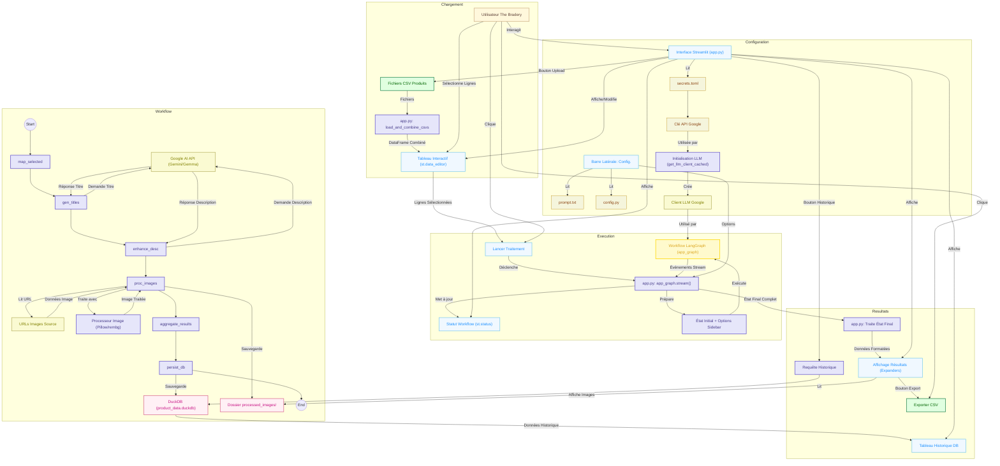

```mermaid	
%%{
  init: {
    'theme': 'base',
    'themeVariables': {
      'primaryColor': '#F8F3EE',        
      'secondaryColor': '#E8CBB6',
      'tertiaryColor': '#D4A58B',
      'mainBkg': '#FFFFFF',            /* White background */
      'nodeBorder': '#A0522D',         /* Sienna border */
      'lineColor': '#8B4513',          /* SaddleBrown lines */
      'textColor': '#333333',          /* Dark text */
      'actorBkg': '#FFF8DC',          /* Cornsilk for user */
      'actorBorder': '#D2B48C',        /* Tan */
      'processBkg': '#ADD8E6',        /* LightBlue for processing */
      'processBorder': '#4682B4',      /* SteelBlue */
      'ioBkg': '#90EE90',            /* LightGreen for IO */
      'ioBorder': '#2E8B57',          /* SeaGreen */
      'storageBkg': '#FFDAB9',        /* PeachPuff for storage */
      'storageBorder': '#CD853F',      /* Peru */
      'externalBkg': '#DDA0DD',        /* Plum for external */
      'externalBorder': '#BA55D3'      /* MediumOrchid */
    }
  }
}%%

graph TD
    %% === Styles ===
    classDef user fill:#FFF8DC,stroke:#D2B48C,stroke-width:2px,color:#5D4037;
    classDef streamlit fill:#F0F8FF,stroke:#87CEEB,stroke-width:2px,color:#1E90FF;
    classDef io fill:#E0FFE0,stroke:#2E8B57,stroke-width:2px,color:#006400;
    classDef processing fill:#E6E6FA,stroke:#6A5ACD,stroke-width:2px,color:#483D8B;
    classDef storage fill:#FFF0F5,stroke:#DB7093,stroke-width:2px,color:#C71585;
    classDef external fill:#FAFAD2,stroke:#BDB76B,stroke-width:2px,color:#808000;
    classDef config fill:#F5F5DC,stroke:#B8860B,stroke-width:1px,color:#8B4513;
    classDef workflow fill:#FFFACD,stroke:#FFD700,stroke-width:2px,color:#DAA520;

    %% === Actors & UI ===
    U["Utilisateur The Bradery"]:::user
    App["Interface Streamlit (app.py)"]:::streamlit

    %% === Inputs ===
    CSV["Fichiers CSV Produits"]:::io
    Sidebar["Barre Latérale: Config."]:::streamlit
    PromptFile["prompt.txt"]:::config
    SecretsFile["secrets.toml"]:::config
    ConfigFile["config.py"]:::config

    %% === Processing Core ===
    LaunchButton["Lancer Traitement"]:::streamlit
    StatusDisplay["Statut Workflow (st.status)"]:::streamlit
    LGSubgraph["Workflow LangGraph (app_graph)"]:::workflow

    %% === External Services / Local Tools ===
    GoogleAPI["Google AI API (Gemini/Gemma)"]:::external
    ImageURLs["URLs Images Source"]:::external
    ImageProc["Processeur Image (Pillow/rembg)"]:::processing

    %% === Storage ===
    DuckDB["DuckDB (product_data.duckdb)"]:::storage
    ProcessedImagesStore["Dossier processed_images/"]:::storage

    %% === Outputs ===
    ResultsDisplay["Affichage Résultats (Expanders)"]:::streamlit
    ExportButton["Exporter CSV"]:::io
    HistoryDisplay["Tableau Historique DB"]:::streamlit

    %% === Workflow ===
    U -- Interagit --> App

    subgraph Configuration
        Sidebar -- Lit --> PromptFile
        Sidebar -- Lit --> ConfigFile
        App -- Lit --> SecretsFile --> GoogleAPIKey["Clé API Google"]:::config
        GoogleAPIKey -- Utilisée par --> InitLLM["Initialisation LLM (get_llm_client_cached)"]:::processing
        InitLLM -- Crée --> LLMClient["Client LLM Google"]:::external
    end

    subgraph Chargement
        direction TB
        App -- Bouton Upload --> CSV
        CSV -- Fichiers --> LoadData["app.py: load_and_combine_csvs"]:::processing
        LoadData -- DataFrame Combiné --> DataEditor["Tableau Interactif (st.data_editor)"]:::streamlit
        App -- Affiche/Modifie --> DataEditor
        U -- Sélectionne Lignes --> DataEditor
    end

    subgraph Execution
        direction TB
        DataEditor -- Lignes Sélectionnées --> LaunchButton
        U -- Clique --> LaunchButton
        LaunchButton -- Déclenche --> InvokeStream["app.py: app_graph.stream()"]:::processing
        InvokeStream -- Prépare --> InitialState["État Initial + Options Sidebar"]:::processing
        InitialState -- Exécute --> LGSubgraph
        LGSubgraph -- Événements Stream --> InvokeStream
        InvokeStream -- Met à jour --> StatusDisplay
        App -- Affiche --> StatusDisplay
    end

    subgraph Workflow
        direction LR
        Start((Start)) --> N1["map_selected"]:::processing
        N1 --> N2["gen_titles"]:::processing
        N2 -- Demande Titre --> GoogleAPI
        GoogleAPI -- Réponse Titre --> N2
        N2 --> N3["enhance_desc"]:::processing
        N3 -- Demande Description --> GoogleAPI
        GoogleAPI -- Réponse Description --> N3
        N3 --> N4["proc_images"]:::processing
        N4 -- Lit URL --> ImageURLs
        ImageURLs -- Données Image --> N4
        N4 -- Traite avec --> ImageProc
        ImageProc -- Image Traitée --> N4
        N4 -- Sauvegarde --> ProcessedImagesStore
        N4 --> N5["aggregate_results"]:::processing
        N5 --> N6["persist_db"]:::processing
        N6 -- Sauvegarde --> DuckDB
        N6 --> EndGraph((End))
    end

    subgraph Resultats
        direction TB
        InvokeStream -- État Final Complet --> ProcessResults["app.py: Traite État Final"]:::processing
        ProcessResults -- Données Formatées --> ResultsDisplay
        App -- Affiche --> ResultsDisplay
        ResultsDisplay -- Affiche Images --> ProcessedImagesStore
        ResultsDisplay -- Bouton Export --> ExportButton
        U -- Clique --> ExportButton
        App -- Bouton Historique --> QueryDB["Requête Historique"]:::processing
        QueryDB -- Lit --> DuckDB
        DuckDB -- Données Historique --> HistoryDisplay
        App -- Affiche --> HistoryDisplay
    end

    %% === Liens Principaux ===
    Sidebar -- Options --> InvokeStream
    LLMClient -- Utilisé par --> LGSubgraph
```