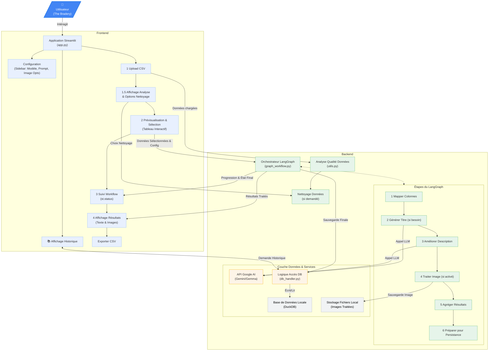

```mermaid	
%%{
  init: {
    'theme': 'base',
    'themeVariables': {
      'primaryColor': '#FFFFFF',        %% Fond blanc
      'lineColor': '#4285F4',           %% Bleu Google pour les lignes
      'textColor': '#333333',           %% Texte sombre
      'clusterBkg': '#F8F9FA',          %% Fond très clair pour les couches
      'clusterBorder': '#D1D5DB'        %% Bordure grise douce
    }
  }
}%%

graph TD;
  direction RL;
    %% === Style Definitions ===
    classDef user fill:#4285F4,stroke:#1A73E8,stroke-width:2px,color:white;
    classDef frontend fill:#E8F0FE,stroke:#8AB4F8,stroke-width:1px,color:#333;
    classDef backend fill:#E6F4EA,stroke:#5BB974,stroke-width:1px,color:#333;
    classDef datalayer fill:#FDF4E7,stroke:#F9AB00,stroke-width:1px,color:#333;
    classDef storage fill:#F1F3F4,stroke:#B0B5BB,stroke-width:1px,color:#000;

    %% === User -> Frontend ===
    U --> |Intéragit| UI_Main;

    %% === Architecture Layers ===

    U[/"👤<br>Utilisateur<br>(The Bradery)"/]:::user;

    subgraph "Frontend"
        direction TB
        UI_Main["Application Streamlit<br>(app.py)"]:::frontend;
        UI_Sidebar["Configuration<br>(Sidebar: Modèle, Prompt, Image Opts)"]:::frontend;
        UI_Upload["1 Upload CSV"]:::frontend;
        UI_Analysis["1.5 Affichage Analyse<br>& Options Nettoyage"]:::frontend;
        UI_Select["2 Prévisualisation & Sélection<br>(Tableau Interactif)"]:::frontend;
        UI_Status["3 Suivi Workflow<br>(st.status)"]:::frontend;
        UI_Results["4 Affichage Résultats<br>(Texte & Images)"]:::frontend;
        UI_History["📚 Affichage Historique"]:::frontend;
        UI_Export["Exporter CSV"]:::frontend;

        %% Frontend Flow
        UI_Main --> UI_Sidebar;
        UI_Main --> UI_Upload;
        UI_Upload --> UI_Analysis;
        UI_Analysis --> UI_Select;
        UI_Select --> UI_Status;
        UI_Status --> UI_Results;
        UI_Results --> UI_Export;
        UI_Main --> UI_History;
    end

    subgraph "Backend"
        direction TB
        BE_Analysis["Analyse Qualité Données<br>(utils.py)"]:::backend;
        BE_Preprocessing["Nettoyage Données<br>(si demandé)"]:::backend;
        BE_LangGraph["Orchestrateur LangGraph<br>(graph_workflow.py)"]:::backend;

        subgraph LG[Étapes du LangGraph]
            direction TB
            LG_Map["1 Mapper Colonnes"]:::backend;
            LG_Map --> LG_Title["2 Générer Titre (si besoin)"]:::backend;
            LG_Title --> LG_Desc["3 Améliorer Description"]:::backend;
            LG_Desc --> LG_Image["4 Traiter Image (si activé)"]:::backend;
            LG_Image --> LG_Aggregate["5 Agréger Résultats"]:::backend;
            LG_Aggregate --> LG_Persist["6 Préparer pour Persistance"]:::backend;
        end

        %% Backend Flow
        BE_Analysis --> BE_Preprocessing;
        BE_LangGraph <-.-> LG;

    subgraph "Couche Données & Services"
        direction TB
        DS_GoogleAI["API Google AI<br>(Gemini/Gemma)"]:::datalayer;
        DS_DuckDB["Base de Données Locale<br>(DuckDB)"]:::storage;
        DS_LocalStorage["Stockage Fichiers Local<br>(Images Traitées)"]:::storage;
        DS_DBHandler["Logique Accès DB<br>(db_handler.py)"]:::datalayer;
    end

    %% === Interactions Inter-Couches ===

    

    %% Frontend -> Backend
    UI_Upload -->|Données chargées| BE_Analysis;
    UI_Analysis -->|Choix Nettoyage| BE_Preprocessing;
    UI_Select -->|Données Sélectionnées & Config| BE_LangGraph; 
    %% Backend -> Data Layer / Services
    LG_Title -->|Appel LLM| DS_GoogleAI;
    LG_Desc -->|Appel LLM| DS_GoogleAI;
    LG_Image -->|Sauvegarde Image| DS_LocalStorage;
    BE_LangGraph -->|Sauvegarde Finale| DS_DBHandler;
    DS_DBHandler -->|Écrit/Lit| DS_DuckDB;

    %% Backend -> Frontend (Résultats)
    BE_LangGraph -->|Progression & État Final| UI_Status;
    BE_LangGraph -->|Résultats Traités| UI_Results;

    %% Frontend -> Data Layer (Historique)
    UI_History <-->|Demande Historique| DS_DBHandler;


    %% === Assign Classes ===
    class U user;
    class UI_Main,UI_Sidebar,UI_Upload,UI_Analysis,UI_Select,UI_Status,UI_Results,UI_Export,UI_History frontend;
    class BE_Analysis,BE_Preprocessing,BE_LangGraph,LG_Map,LG_Title,LG_Desc,LG_Image,LG_Aggregate,LG_Persist backend;
    class DS_GoogleAI,DS_DBHandler datalayer;
    class DS_DuckDB,DS_LocalStorage storage;
end
```